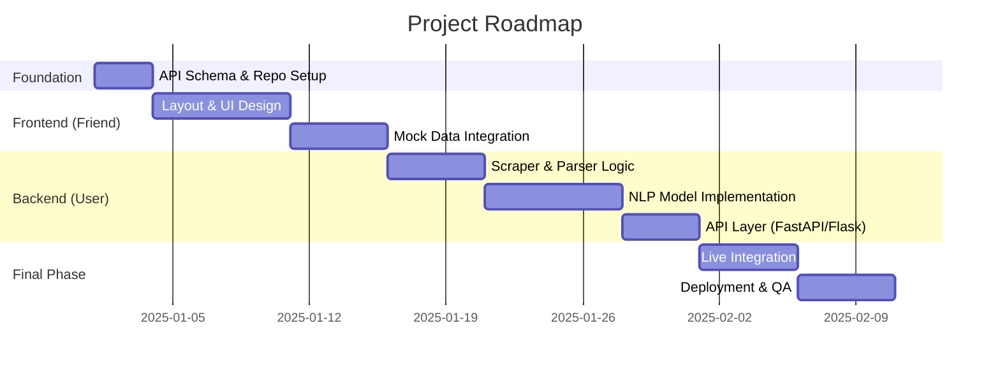

# Total Project Master Plan: Automated News Summarizer

This document serves as the official roadmap for the **Automated News Summarizer**. It defines the split of responsibilities between **Backend** (User) and **Frontend** (Friend) to ensure a seamless integration.

---

## 📅 High-Level Roadmap



---

## 🛠️ Module Breakdown & Responsibilities

### 1. The Gateway (Joint Responsibility)
*Before coding, both must agree on the communications protocol.*
- **Protocol**: RESTful API (JSON over HTTP).
- **Endpoint**: `POST /api/v1/summarize`
- **Data Contract**:
  - **Request**: `{ "url": "string", "length": "short|medium|long" }`
  - **Response**:
    ```json
    {
      "metadata": { "title": "string", "author": "string", "date": "string" },
      "summary_paragraph": "string",
      "summary_bullets": ["string", "string"],
      "sentiment": { "label": "string", "score": 0.0 },
      "original_length": 0,
      "summary_length": 0
    }
    ```

### 2. Frontend Track (Friend)
*Focus: User Experience, Styling, and Interface logic.*
- **Task F1: UI Shell**: Develop a premium, responsive landing page.
- **Task F2: Input Handling**: URL validation (regex) and user feedback.
- **Task F3: Loading States**: Implement a "System is thinking..." animation (crucial for AI latency).
- **Task F4: Results Visualization**: 
  - Sentiment "Mood Meter".
  - Copy-to-clipboard for summaries.
  - Download as PDF/Txt functionality.

### 3. Backend Track (User)
*Focus: Data extraction, AI inference, and Performance.*
- **Task B1: Web Extraction Pipeline**:
  - `Scraper`: Handle headers, proxies, and timeouts.
  - `Parser`: Extract clean content using BeautifulSoup/Readability.
- **Task B2: NLP Engine**:
  - Load `facebook/bart-large-cnn` for summarization.
  - Load `sentiment-analysis` pipeline for tone detection.
  - Sentence tokenization for bullet-point formatting.
- **Task B3: API Implementation**: 
  - Build the server using **FastAPI** (for speed and auto-docs).
  - Implement CORS to allow the Frontend to talk to the Backend.

---

## 🧪 Testing & Quality Gates

| Gate | Description | Passing Criteria |
| :--- | :--- | :--- |
| **Unit** | Individual functions (e.g., `clean_text`) | 100% pass on edge cases (empty strings, etc.) |
| **Integration** | Frontend calling Backend | API returns valid JSON within 15 seconds |
| **E2E** | Full user flow | Paste URL -> Receive valid summary on screen |
| **Load** | Handling large articles | Successfully summarizes 2000+ word articles |

---

## 🚀 Deployment Strategy

- **Backend**: Containerize using **Docker** and deploy to **AWS Lambda** or **Render** for easy scaling of NLP models.
- **Frontend**: Deploy to **Vercel** or **Streamlit Cloud** for global accessibility.
- **CI/CD**: Set up GitHub Actions to auto-deploy when changes are pushed to `main`.

---

> [!IMPORTANT]
> **Integration Warning**: AI models are heavy. The Backend *must* implement a timeout or asynchronous worker (like Celery) if the summaries take longer than 30 seconds to prevent the browser from timing out.
